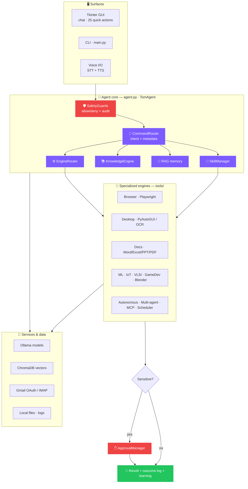
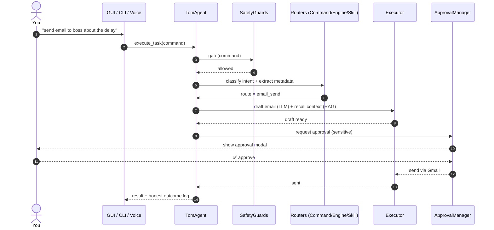
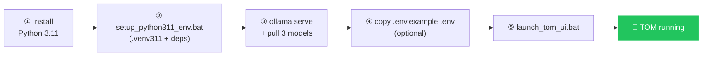
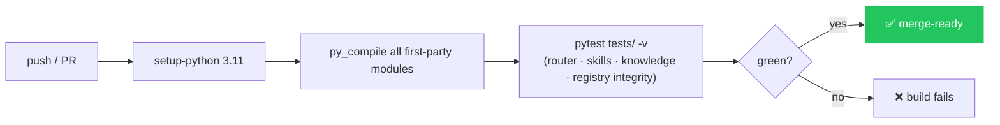
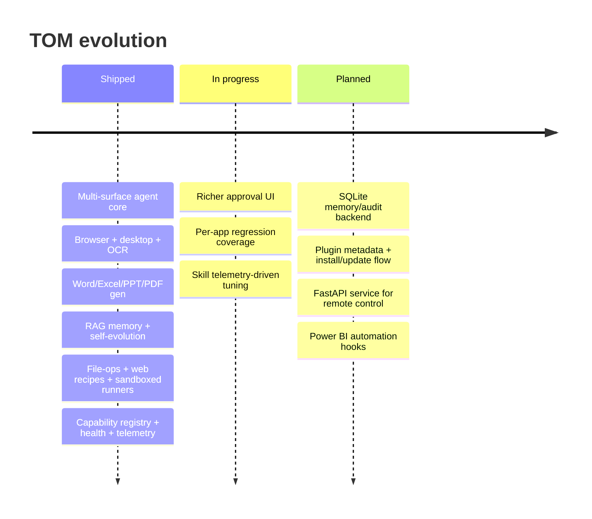
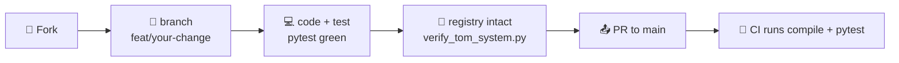

<!-- ════════════════════════════════════════════════════════════════════════ -->
<!--  TOM — Local Autonomous Desktop Agent · flagship README                   -->
<!--  Hero banner is a self-contained animated SVG (docs/assets/banner.svg),   -->
<!--  so animation works on GitHub without any external service. Typing/badges -->
<!--  use shields.io + readme-typing-svg (render on GitHub with internet).     -->
<!--  Screenshot/GIF links point at docs/assets/* — see that folder's README   -->
<!--  for how to drop the real captures in. Missing files show alt-text.       -->
<!-- ════════════════════════════════════════════════════════════════════════ -->

<div align="center">



<br/>


<br/><br/>

<!-- Tech / status badges -->


<!-- Live repo badges -->


<!-- Feature flags -->


<br/>

### [ 🚀 Quick start ](#-quick-start) · [ 🧩 Features ](#-feature-showcase) · [ 🏛️ Architecture ](#️-architecture) · [ 🧠 Intelligence ](#-intelligence-layer) · [ 🛠️ Setup ](SETUP.md) · [ ❓ FAQ ](#-faq)

</div>

---

<div align="center">

> ### TOM is a **Windows-first, 100% local** AI agent that runs your laptop through plain language.
>
> One local **Ollama** model + browser automation + desktop control + document generation +
> voice + background agents + semantic memory — on your machine, **no cloud API keys** for the core.

</div>

<table align="center">
<tr>
<td align="center" width="33%">🏠<br/><b>Runs entirely local</b><br/><sub>Ollama LLM · ChromaDB memory · your data never leaves the machine</sub></td>
<td align="center" width="33%">🗣️<br/><b>One natural-language surface</b><br/><sub>GUI chat · 25 quick actions · CLI · voice — same brain behind all</sub></td>
<td align="center" width="33%">🛡️<br/><b>Safe by design</b><br/><sub>human approval before sending, deleting, running code; full audit trail</sub></td>
</tr>
</table>

---

## 🗺️ Navigation

<div align="center">

| Get going | Understand it | Go deeper |
|:--|:--|:--|
| [🚀 Quick start](#-quick-start) | [🧩 Feature showcase](#-feature-showcase) | [🧱 Module / capability reference](#-module--capability-reference) |
| [🛠️ Configuration](#️-configuration) | [🏛️ Architecture](#️-architecture) | [🗂️ Project structure](#️-project-structure) |
| [🖥️ The desktop app](#️-the-desktop-app) | [🔀 Command workflow](#-command-workflow) | [🧪 Testing & CI](#-testing--ci) |
| [📦 Build & deploy](#-build--deploy) | [🧠 Intelligence layer](#-intelligence-layer) | [🤝 Contributing](#-contributing) |
| [🩹 Troubleshooting](#-troubleshooting) | [🤖 Models](#-models) | [🗓️ Roadmap](#️-roadmap) · [❓ FAQ](#-faq) |

</div>

---

## ✨ Demo

<div align="center">

<!-- Drop docs/assets/demo.gif in to replace this. See docs/assets/README.md -->


<sub>📹 <b>Placeholder.</b> Add <code>docs/assets/demo.gif</code> to show a real command end-to-end — see <a href="docs/assets/README.md">docs/assets/README.md</a>.</sub>

</div>

<table>
<tr>
<td width="50%"></td>
<td width="50%"></td>
</tr>
<tr>
<td align="center"><sub>🟦 Dashboard — animated orb + quick actions</sub></td>
<td align="center"><sub>🟪 Chat — with human-in-the-loop approval modal</sub></td>
</tr>
</table>

---

## 🧩 Feature showcase

> The list below mirrors `tools/capability_registry.py`, which **CI validates against real
> executors** on every push. If a capability is listed here, it maps to code that runs —
> **no vapourware.** Every capability is reachable from the GUI chat, the quick-action
> buttons, and the CLI (a few are GUI/CLI-only, noted inline).

<table>
<tr>
<td align="center" width="25%">📄<br/><b>Documents</b><br/><sub>Word · Excel · PPT · PDF · letters</sub></td>
<td align="center" width="25%">✉️<br/><b>Communication</b><br/><sub>email draft/send · inbox triage · WhatsApp</sub></td>
<td align="center" width="25%">📊<br/><b>Data &amp; ML</b><br/><sub>analysis · dashboards · ML · vision</sub></td>
<td align="center" width="25%">🌐<br/><b>Web</b><br/><sub>search · site gen · scrape · verify · safety</sub></td>
</tr>
<tr>
<td align="center">🖥️<br/><b>System &amp; desktop</b><br/><sub>open apps · OCR · mouse/kbd · file ops</sub></td>
<td align="center">💻<br/><b>Code &amp; dev</b><br/><sub>write/run code · IoT · VLSI · games · Blender</sub></td>
<td align="center">🤖<br/><b>Agents</b><br/><sub>autonomous · multi-agent · daemons · MCP · scheduler</sub></td>
<td align="center">🎙️<br/><b>Voice &amp; brain</b><br/><sub>voice mode · RAG memory · skills · self-evolution</sub></td>
</tr>
</table>

<details open>
<summary><b>📄 Documents</b></summary>

| Capability | Example command | Executor |
|---|---|---|
| Word documents | `create a professional Word document about renewable energy` | `agent.py::_create_word_doc` |
| Excel spreadsheets | `create an Excel spreadsheet for a monthly budget` | `agent.py::_create_excel` |
| PowerPoint decks | `create a PowerPoint about our Q3 results` | `agent.py::_execute_presentation` |
| PDF reports | `create a PDF report about market trends` | `agent.py::_create_pdf` |
| Letters / essays / long-form | `write a formal letter to my landlord` | `agent.py::_execute_document_writing` |

</details>

<details>
<summary><b>✉️ Communication</b></summary>

| Capability | Example | Notes |
|---|---|---|
| Draft context-aware emails | `write an email to John about the meeting` | LLM-drafted |
| Send email | `send email to john@x.com` | **approval-gated** |
| Inbox triage (summarize · rank · draft replies) | `check my inbox` | Gmail OAuth / IMAP |
| WhatsApp messages | `whatsapp Mom saying I'll be late` | via browser session |

</details>

<details>
<summary><b>📊 Data, analysis &amp; machine learning</b></summary>

| Capability | Example |
|---|---|
| Full pipeline: clean → insights → charts → **HTML dashboard** | `analyze the data in sales.csv` |
| Analyze any file (image / PDF / media) | `analyze file: C:\reports\scan.pdf` |
| ML — regression · classification · clustering · forecast · anomaly | `train a regression model` |
| Image / vision analysis | `analyze this image` |

`tools/ml_engine.py` auto-detects backends (scikit-learn, optionally XGBoost / LightGBM /
CatBoost / PyTorch / TensorFlow) and degrades gracefully when one is absent.

</details>

<details>
<summary><b>🌐 Web</b></summary>

| Capability | Example |
|---|---|
| Web search + research | `search the web for the latest on Llama models` |
| Generate websites (live browser preview) | `create a website for a coffee shop` |
| Verify running web apps / localhost | `verify web app on localhost:3000` |
| Website safety analysis | `check website safety: https://example.com` |
| Scrape web tables → CSV | `scrape the tables from <URL>` |
| Download files from URLs (capped 200 MB) | `download the file from <URL>` |

</details>

<details>
<summary><b>🖥️ System &amp; desktop</b></summary>

| Capability | Example |
|---|---|
| Open any installed application | `open chrome` |
| Read the screen via OCR (Tesseract) | `read my screen` |
| Mouse / keyboard / volume control | `move mouse to 500 300`, `volume to 40` |
| Create / read / manage files | `create file notes.txt`, `read file report.md` |
| File ops: find / organize / rename / zip | `organize my downloads folder by type` *(dry-run + approval)* |
| Convert images between formats | `convert all images in pictures to png` |

</details>

<details>
<summary><b>💻 Code &amp; development</b></summary>

| Capability | Example |
|---|---|
| Write code projects | `write code for a REST API in FastAPI` |
| Run Python files | `run code script.py` *(sandboxed · approval-gated · timed)* |
| Run Node.js files | `run app.js` *(approval-gated)* |
| Run shell commands | `run shell: dir` *(approval-gated · denylisted)* |
| Debug / fix code | `fix my code` |
| Python env / dependency management | `create venv`, `check dependency conflicts` |
| IoT firmware (ESP32 / Arduino / MicroPython) | `generate esp32 dht11 mqtt firmware` |
| VLSI / Verilog / VHDL / RTL / embedded | `create a verilog counter width=8` |
| Game scaffolding (pygame / Unity / Godot) | `scaffold a pygame platformer` |
| Blender 3D control | `blender create a terrain` |

</details>

<details>
<summary><b>🤖 Agents &amp; automation</b></summary>

| Capability | Example |
|---|---|
| Autonomous multi-step (plan → research → execute → verify → learn) | `execute autonomous task: research and summarize X` |
| Multi-agent orchestration (CEO/CTO/CMO/CPO/CFO/COO) | `deploy multi-agent task: launch a product page` |
| Scaffold new sub-agents | `build agent called price_watcher` |
| Email agent daemon | `start email agent` |
| Instagram agent daemon + AI-news reports | `start instagram agent` |
| News briefings & roundups | `give me the daily briefing` |
| Schedule **any** task on a repeat interval | `schedule: check inbox every 2 hours` |
| Background task scheduling (APScheduler) | `schedule instagram reports` |
| MCP connectors (GitHub / Slack / Notion / Calendar / Weather …) | `check my github repos` |
| Self-update checks | `update tom` |

</details>

<details>
<summary><b>🎙️ Voice &amp; intelligence</b></summary>

| Capability | Notes |
|---|---|
| Voice conversation mode | Speech-to-text in, text-to-speech out · GUI + CLI |
| Text emotion analysis | `analyze emotion text: ...` |
| Curated knowledge retrieval | auto-injected into relevant queries |
| Skill-guided expertise | 47 local skills, +864 opt-in (auto-routed) |
| Semantic conversation memory (RAG / ChromaDB) | remembers everything by meaning |
| Self-evolution from feedback | learns your preferences from reward/penalty |

</details>

---

## 🧰 Technology stack

<div align="center">

**Core brain**
&nbsp;


**Automation**
&nbsp;


**Data / ML**
&nbsp;


**UI / docs / packaging**
&nbsp;


</div>

---

## 🏛️ Architecture

TOM is a layered local platform. One agent core (`agent.py` → `TomAgent`) sits behind every
surface and routes each request through safety, intent, and specialized engines.



> Full layer-by-layer spec, DB schema, and plugin contract live in [ARCHITECTURE.md](ARCHITECTURE.md).

---

## 🔀 Command workflow

What happens between you typing and TOM acting:



Routing is **additive & failure-isolated**: no clear engine match → falls through to normal
skill/chat routing. Engines are lazy-loaded — a missing optional dependency degrades to an
explanatory message instead of crashing.

---

## 🖥️ The desktop app

`tom_desktop_app.py` is a Tkinter shell tuned for a bright room and high contrast (design
rationale: [PRODUCT.md](PRODUCT.md)). Opens at **1420×880**.

```
┌──────────────┬───────────────────────────────────────────────┐
│  ▦ Dashboard │   ◍ animated "alive" orb · live status         │
│  ▤ Chat      │   ▸ 25 quick-action buttons                    │
│  ◎ System    │   ┌─────────────────────────────────────────┐  │
│  ▧ Charts    │   │  chat / active view                     │  │
│  ▥ Files     │   │  + approval modals (sensitive actions)  │  │
│  ◈ Capabil.  │   └─────────────────────────────────────────┘  │
│  ⚕ Health    │   profiles: Core TOM · Email · Instagram        │
│  ♪ Voice     │   ▶ Run Agent      ♫ Voice Mode                 │
└──────────────┴───────────────────────────────────────────────┘
```

| View | What it shows |
|---|---|
| **Dashboard** | Animated orb, live status, metrics, **25 quick actions** |
| **Chat** | Main conversation + approval modals |
| **System / Charts / Files** | Runtime panels |
| **Capabilities** | Browsable list of everything TOM can do |
| **Health** | Runtime capability-health report (`tools/capability_health.py`) |

**Agent profiles:** Core TOM · Email Agent · Instagram Agent. **Voice Mode** opens a
push-to-talk window. Shortcuts: `Ctrl+D` Dashboard · `Ctrl+C` Chat.

---

## 🧠 Intelligence layer

| Layer | Module | What it gives you |
|---|---|---|
| 🔎 **RAG memory** | `tools/rag_memory.py` | ChromaDB + `nomic-embed-text`; recalls conversations/docs/knowledge by *meaning*. 100% local. |
| 🌱 **Self-evolution** | `tools/self_evolution.py` | Adaptive prompting from reward/penalty; learns your preferences. No GPU training. |
| 🧩 **Skills** | `tools/skill_manager.py` | 47 local domain skills + opt-in `SKILL.md` packs, classified knowledge-only vs executable. |
| 📈 **Skill telemetry** | `tools/skill_telemetry.py` | Tracks which skills actually run + complete/fail/degrade. |
| ⚕️ **Capability health** | `tools/capability_health.py` | Runtime self-check (shown in the Health view). |
| 📚 **Knowledge base** | `knowledge/` | JSON domain packs (Game Dev, 3D/CGI, Web, Cybersecurity, Data Science & AI, Mobile, Medical) + Markdown notes, auto-injected. |

---

## 🤖 Models

**Model-agnostic** — every slot is an env var, hot-swappable at runtime via `switch_model(name)`.

| Slot | Env var | Default |
|---|---|---|
| 🧠 Primary (complex reasoning) | `OLLAMA_MODEL` | `gemma4:latest` |
| ⚡ Fast (parsing · NLP · chat) | `OLLAMA_FAST_MODEL` | `qwen2.5-coder:7b-instruct` |
| 💻 Code generation | `OLLAMA_CODE_MODEL` | `qwen2.5-coder:7b-instruct` |
| 🔢 Embeddings (RAG memory) | `OLLAMA_EMBED_MODEL` | `nomic-embed-text:latest` |

> Ollama offline → UI still starts, but reasoning, planning, and RAG memory are limited.

---

## 🚀 Quick start

> ⚠️ **Requires Python 3.11.x specifically** (not 3.10, not 3.12). Full guide → [SETUP.md](SETUP.md).



```powershell
# 1️⃣  Create the 3.11 environment + install deps (one-time)
setup_python311_env.bat

# 2️⃣  Start Ollama and pull the models
ollama serve
ollama pull gemma4:latest
ollama pull qwen2.5-coder:7b-instruct
ollama pull nomic-embed-text:latest

# 3️⃣  (Optional) copy and edit config
copy .env.example .env

# 4️⃣  Launch
launch_tom_ui.bat
```

| Launcher | When to use |
|---|---|
| `launch_tom_ui.bat` | Normal launch (auto-finds Python 3.11, checks deps) |
| `launch_tom_safe.bat` | Voice disabled, console visible — **use first if it crashes** |
| `launch_tom_debug.bat` | Console visible for full tracebacks |
| `python main.py` | CLI mode (no GUI) |
| Desktop **TOM** shortcut | Runs built `dist\tom_desktop_app.exe` (after `build.bat`) |

---

## ⚙️ Configuration

Settings live in `.env` (copy from [.env.example](.env.example)). Nothing is required to
*start* — every value has a default.

<details>
<summary><b>Show all config groups</b></summary>

- **Core (LLM):** `OLLAMA_BASE_URL`, `OLLAMA_MODEL`, `OLLAMA_FAST_MODEL`,
  `OLLAMA_CODE_MODEL`, `OLLAMA_EMBED_MODEL`, `OLLAMA_TIMEOUT_SECONDS`, `TASK_TIMEOUT_SECONDS`.
- **Email** (Gmail/inbox): `EMAIL_ADDRESS`, `EMAIL_PASSWORD`, `GMAIL_CREDENTIALS_FILE`,
  `GMAIL_TOKEN_FILE`, `IMAP_HOST`, `IMAP_PORT`, `SMTP_SERVER`, `SMTP_PORT`
  → see [GMAIL_OAUTH_SETUP.md](GMAIL_OAUTH_SETUP.md).
- **Instagram agent:** `INSTAGRAM_CHROME_PROFILE`, `INSTAGRAM_POSTS_PER_RUN`,
  `INSTAGRAM_CHECK_INTERVAL_SECONDS`, `INSTAGRAM_AUTO_SEND_REPORT_EMAIL`, …
- **Browser:** `CHROME_EXECUTABLE`, `CHROME_PROFILE_PATH`.
- **OCR:** `TESSERACT_CMD` (only if Tesseract isn't on PATH).
- **Voice:** `VOICE_INPUT_ENABLED`, `VOICE_OUTPUT_ENABLED`, `TOM_VOICE`, `TOM_VOICE_RATE`,
  `VOICE_RECOGNITION_ENGINE`, tuning thresholds.

</details>

> ✅ **No API keys** for Chrome automation, Instagram/YouTube browsing, or local Office —
> those use your signed-in browser session and local apps.

Full annotated reference: [.env.example](.env.example) · [ENVIRONMENT_SETUP_GUIDE.md](ENVIRONMENT_SETUP_GUIDE.md).

---

## 🧱 Module / capability reference

TOM has no public HTTP API — it's a local agent. The "API" is the **capability registry**
(`tools/capability_registry.py`): a single source of truth mapping each advertised
capability to a real executor. `validate()` proves every executor exists; `find_orphan_tools()`
proves no tool module is dead. **CI fails the build if either contract breaks.**

<details>
<summary><b>Capability → executor map (excerpt)</b></summary>

| ID | Capability | Executor |
|---|---|---|
| `word_doc` | Create Word documents | `agent.py::_create_word_doc` |
| `excel` | Create Excel spreadsheets | `agent.py::_create_excel` |
| `email_send` | Send emails (with approval) | `agent.py::execute_email_send_flow` |
| `data_analysis` | Clean→insights→charts→dashboard | `tools/data_analysis.py::DataAnalysisEngine.generate_report` |
| `ml` | ML train/predict | `tools/engine_router.py::EngineRouter._run_ml` |
| `website_build` | Generate websites | `agent.py::execute_website_creation` |
| `code_run` | Run Python (sandboxed) | `tools/code_runner.py::CodeRunner.run_python_file` |
| `iot` | IoT firmware | `tools/engine_router.py::EngineRouter._run_iot` |
| `vlsi` | Verilog / RTL | `tools/engine_router.py::EngineRouter._run_vlsi` |
| `autonomous` | Multi-step autonomous | `tools/autonomous_agent.py::AutonomousAgent.execute` |
| `multi_agent` | CEO/CTO/CMO orchestration | `tools/agent_orchestrator.py::AgentOrchestrator.execute_task` |
| `mcp` | External connectors | `agent.py::_handle_mcp_request` |
| `rag_memory` | Semantic memory | `tools/rag_memory.py::get_rag` |

…and ~30 more. See the registry file for the full, CI-checked list.

</details>

**Built-in MCP connectors** (`tools/mcp_manager.py`): `github`, `gmail`, `slack`, `notion`,
`whatsapp`, `instagram`, `calendar`, `weather`, `websearch`, `filesystem`, `database`.

---

## 🗂️ Project structure

```text
tom_autonomous_agent/
├─ 🖥️  tom_desktop_app.py        # Tkinter GUI (primary entry point)
├─ 🧠  agent.py                  # TomAgent — orchestration, routing, execution, logging
├─ ⌨️   main.py                   # CLI entry point
├─ 🛡️  safety/guards.py          # allow/deny rules + audit logging
├─ 🧰  tools/                    # all capability engines (45+ modules)
│   ├─ command_router · engine_router · skill_manager · knowledge_engine
│   ├─ capability_registry · capability_health · skill_telemetry · approval
│   ├─ browser_tools · chrome_profiles · screen_tools · file_tools · file_ops
│   ├─ email_tools · whatsapp_tools · web_recipes · web_automation
│   ├─ code_runner · ml_engine · iot_engine · vlsi_engine · game_dev · blender_control
│   ├─ data_analysis · document_creator · pdf_tools · hardware_control
│   ├─ voice_tools · voice_enhanced · rag_memory · self_evolution · learning
│   └─ scheduler · autonomous_agent · agent_orchestrator · mcp_manager · news_agent …
├─ 🤖  agents/                   # discoverable sub-agents (email, instagram, ai-news)
├─ 📚  knowledge/                # JSON domain packs + Markdown notes
├─ 🧩  skills/                   # 47 numbered domain skills + SKILL.md packs
├─ 🧷  memories/                 # lifetime chat + session experiences (JSON)
├─ 📒  tom_logs/                 # audit log, skill telemetry, agent state
├─ ⚙️   config/                   # system_prompt.txt
├─ 🎨  resources/                # icons / artwork (tom_icon.png/.svg/.ico)
├─ 🖼️  docs/assets/              # README banner + screenshots/GIF
├─ 📦  installer/tom_installer.iss  # Inno Setup script
├─ 🧪  tests/                    # pytest suite
├─ 🔁  .github/workflows/ci.yml  # compile + pytest on push/PR
└─ 📌  requirements.txt          # pinned deps (Python 3.11 only)
```

---

## 🧪 Testing & CI

```powershell
# Diagnostic self-check (imports, capabilities, optional libs)
.venv311\Scripts\python.exe tools\verify_tom_system.py

# Test suite (pytest.ini pins --basetemp to .pytest_tmp on Windows)
.venv311\Scripts\python.exe -m pytest
```

**GitHub Actions** (`.github/workflows/ci.yml`) runs on every push & PR:



The suite covers command routing, engine detection, **capability-registry integrity** (no
fake capabilities, no orphan tools), reliability, voice fixes, skill/knowledge loading,
telemetry, and the Phase B task suites.

---

## 📦 Build & deploy

```powershell
build.bat        # cleans → PyInstaller via tom_desktop_app.spec → emits SHA256
# Output: dist\tom_desktop_app.exe  (+ dist\SHA256SUMS.txt)

SETUP_TOM.bat    # one-shot: env setup → build → Desktop shortcut

iscc installer\tom_installer.iss   # Windows installer (Inno Setup)
```

> ⚠️ Binary is **unsigned** → SmartScreen may warn on first run. **Rebuild after every code
> change** — the frozen EXE doesn't auto-pick-up edits and **does not read `.env`** (env-gated
> features fall back to bootstrap defaults; voice defaults ON in the bundle).

---

## ⚡ Performance & reliability highlights

- **Timeouts everywhere** — `OLLAMA_TIMEOUT_SECONDS` and `TASK_TIMEOUT_SECONDS` keep a slow
  model or stuck task from freezing the UI.
- **Lazy + failure-isolated engines** — a missing optional dependency degrades to a message,
  never a crash.
- **Honest outcome logging** — results recorded as success / partial / failed, not
  optimistically faked.
- **Multi-model routing** — heavy reasoning, fast parsing, and code generation use separate
  model slots so light tasks stay snappy.
- **Local-first** — no network round-trips for inference or memory.

---

## 🔒 Security & privacy

- ✋ **Human-in-the-loop approval** before sending email/messages, deleting or moving/renaming
  files, and running code/shell.
- 🛡️ **SafetyGuards** (`safety/guards.py`) apply allow/deny rules + a timestamped audit trail
  in `tom_logs/`.
- 📋 **File ops** that move/rename build a **dry-run plan first** with exact counts; system
  directories are never traversed.
- 📦 **Code/shell** runs in an isolated subprocess with a hard timeout + denylist — never
  in-process `exec()`.
- 🔑 **Secrets stay out of git** — `.env`, `*credentials*.json`, `*token*.json`, `*.pem`,
  `*.key` are git-ignored. No passwords in code; prefer OAuth / existing browser sessions.
- 🏠 **Everything local** — Ollama, ChromaDB memory, and your data stay on your machine.

---

## 🗓️ Roadmap



> Roadmap is distilled from [ARCHITECTURE.md](ARCHITECTURE.md) §14. Items move as the code lands.

---

## 🤝 Contributing



1. **Fork** and create a feature branch: `git checkout -b feat/my-change`.
2. Work in the **Python 3.11** env (`setup_python311_env.bat`).
3. Add a real executor for any new capability **and** register it in
   `tools/capability_registry.py` — CI rejects fake capabilities and orphan tools.
4. Run `pytest` and `python tools/verify_tom_system.py` before opening a PR.
5. Keep changes **additive and failure-isolated** (lazy imports, graceful degradation).
6. Match the house rules in [CLAUDE.md](CLAUDE.md) / [AGENTS.md](AGENTS.md): verify before
   you ship, no untested code, honest uncertainty.

---

## ❓ FAQ

<details>
<summary><b>Does TOM send my data to the cloud?</b></summary>

No. The LLM (Ollama), vector memory (ChromaDB), and your files all stay local. The only
network calls are ones you explicitly trigger — web search, browser automation on sites
you visit, or Gmail if you configure it.
</details>

<details>
<summary><b>Do I need any API keys?</b></summary>

Not for the core. Chrome automation, Instagram/YouTube browsing, WhatsApp-via-browser, and
local Office automation use your signed-in sessions. Only Gmail OAuth (optional) and some
MCP connectors need credentials.
</details>

<details>
<summary><b>Why Python 3.11 only?</b></summary>

The pinned dependency set and the frozen EXE build target 3.11. The launchers refuse other
versions to avoid hard-to-debug native/ABI mismatches.
</details>

<details>
<summary><b>Can I use a different model?</b></summary>

Yes — set `OLLAMA_MODEL` (and the fast/code/embed slots) to any Ollama model, or call
`switch_model(name)` at runtime to hot-swap all slots.
</details>

<details>
<summary><b>Voice won't start — what now?</b></summary>

Launch with `launch_tom_safe.bat` (voice off) to confirm the rest works, then install
`SpeechRecognition` + PyAudio (a prebuilt `cp311` wheel on Windows). See [SETUP.md](SETUP.md).
</details>

<details>
<summary><b>Is there a web/remote UI?</b></summary>

Not yet — a FastAPI service is on the roadmap. Today TOM is a local Tkinter desktop app
(plus a CLI).
</details>

---

## 🩹 Troubleshooting

| Symptom | Fix |
|---|---|
| "TOM requires Python 3.11.x" | Install official Python 3.11, then `setup_python311_env.bat`. |
| "TOM dependencies are missing" | Re-run `setup_python311_env.bat`. |
| LLM replies limited / empty | Start Ollama (`ollama serve`) and pull the models above. |
| Voice error re `SpeechRecognition`/`pyaudio` | Install them; on Windows use a prebuilt PyAudio wheel (see SETUP.md). |
| Voice misbehaving | `launch_tom_safe.bat` (voice off) or `VOICE_INPUT_ENABLED=false`. |
| Chrome profile launch fails | Confirm Chrome installed + profile exists; optionally set `CHROME_PROFILE_PATH`. |
| Screen reading does nothing | Install Tesseract OCR; set `TESSERACT_CMD` if not on PATH. |
| EXE ignores edits / `.env` | Rebuild with `build.bat`; run from source for `.env`. |
| pytest permission errors in temp | Don't override `--basetemp`; it's pinned to `.pytest_tmp` in `pytest.ini`. |

Deeper setup + new-machine checklist → [SETUP.md](SETUP.md).

---

## 🙌 Credits & license

**Author / owner:** Rajesh Ponnapureddy — built TOM as a daily-driver personal automation
agent (see [PRODUCT.md](PRODUCT.md)).

Built on the open-source ecosystem: **Ollama**, **LangChain**, **ChromaDB**,
**sentence-transformers**, **Playwright**, **PyAutoGUI**, **Tesseract**, **pandas /
NumPy / scikit-learn**, **python-docx / python-pptx / ReportLab**, **APScheduler**,
**PyInstaller**, **pytest**.

> ⚠️ **License:** this repo has **no `LICENSE` file yet**. Until one is added, default
> copyright applies (all rights reserved) — others can view but not legally reuse it. Add a
> license (e.g. MIT / Apache-2.0) via <https://choosealicense.com> to make reuse explicit.

<div align="center">

<br/>


<br/>

⭐ **Star this repo** if TOM is useful — it helps a lot.

<sub>TOM — Local Autonomous Desktop Agent · Windows · Python 3.11 · Ollama</sub>

</div>
